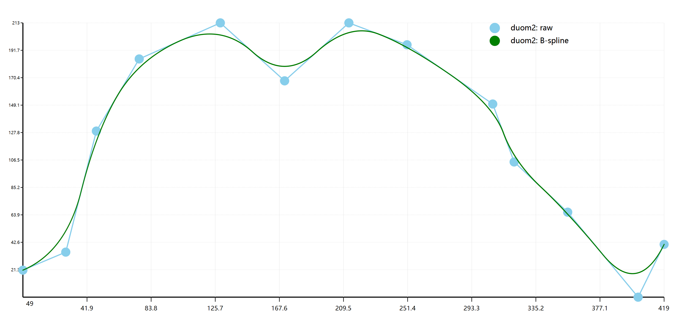
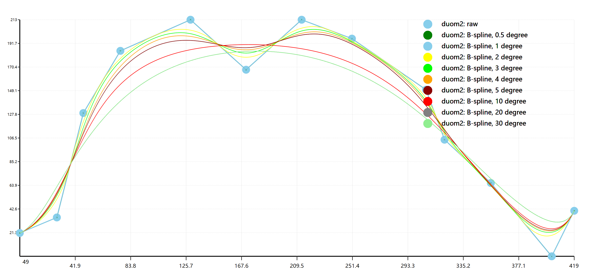
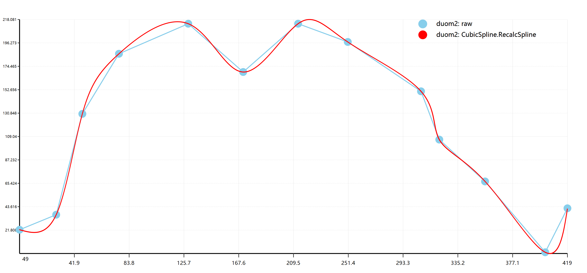
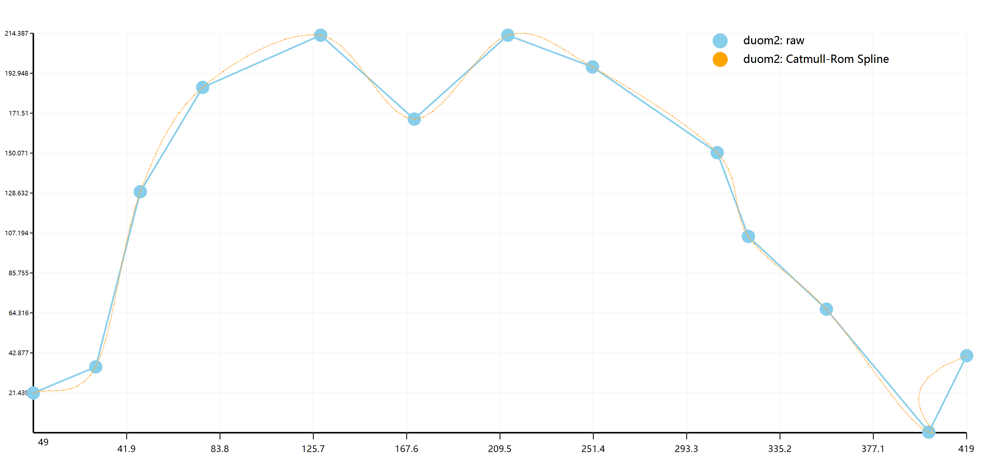
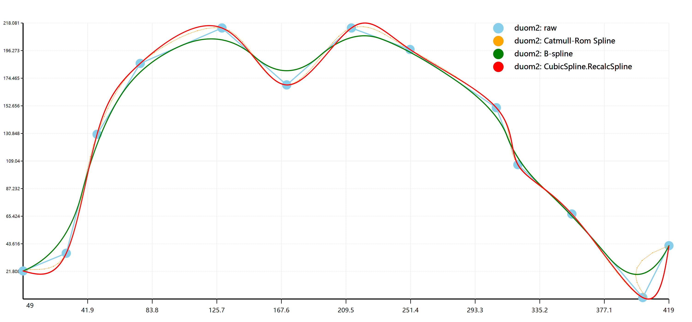
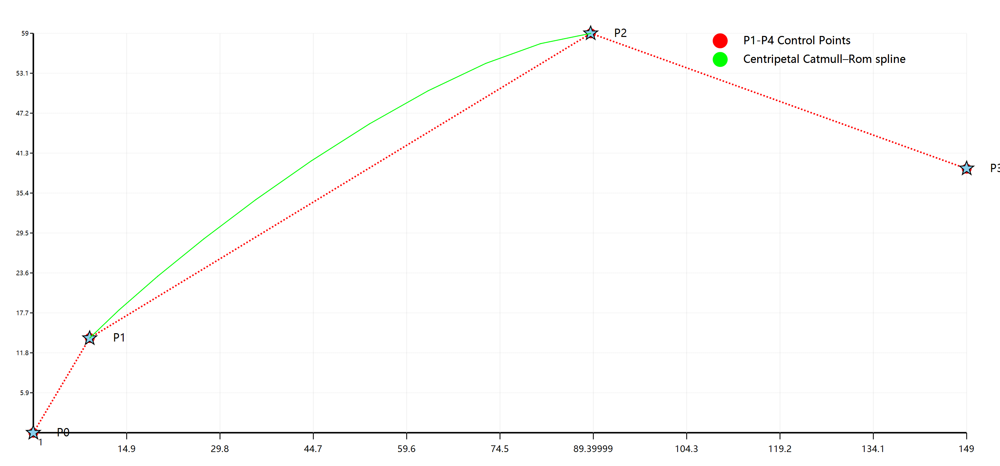
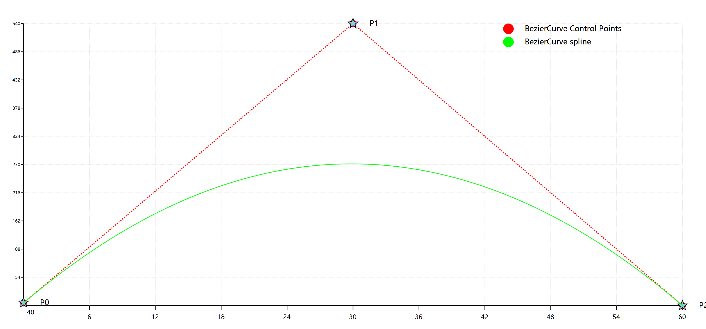

# [Curve Interpolation Tools](../../Math/Spline)

```vbnet
Imports Microsoft.VisualBasic.Mathematical.Interpolation
```

##### Data used in this README

Testing data from this file: [duom2.txt](./duom2.txt)

```vbnet
Dim data#()() = "./duom2.txt" _
    .IterateAllLines _
    .ToArray(Function(s) Regex.Replace(s, "\s+", " ") _
        .Trim _
        .Split _
        .ToArray(AddressOf Val))
Dim points As PointF() = data _
    .ToArray(Function(c) New PointF With {
        .X = c(Scan0),
        .Y = c(1)
    })
Dim raw = points.FromPoints(
    lineColor:="skyblue",
    ptSize:=40,
    title:="duom2: raw")
```

## B-spline
In the mathematical subfield of numerical analysis, a B-spline, or basis spline, is a spline function that has minimal support with respect to a given degree, smoothness, and domain partition. Any spline function of given degree can be expressed as a linear combination of B-splines of that degree. Cardinal B-splines have knots that are equidistant from each other. B-splines can be used for curve-fitting and numerical differentiation of experimental data.

In the computer-aided design and computer graphics, spline functions are constructed as linear combinations of B-splines with a set of control points.

> This tools source code was translated from the original work of @kerrot : [B_Spline](https://github.com/kerrot/B_Spline)

#### How to use

```vbnet
Dim result = B_Spline.Compute(points, degree, RESOLUTION:=100)
```

###### Example

```vbnet
result = B_Spline.Compute(points,, RESOLUTION:=100)

Dim B_interplot = result.FromPoints(
    lineColor:="green",
    ptSize:=15,
    title:="duom2: B-spline",
    lineType:=DashStyle.Dash,
    lineWidth:=3)

Call Scatter.Plot({raw, B_interplot}, size:=New Size(3000, 1400)) _
    .SaveAs("./duom2-B-spline.png")
```



#### Compares B-Splines Parameters

```vbnet
Dim bsplines = {
    B_Spline.Compute(points, 0.5, RESOLUTION:=100) _
            .FromPoints(lineColor:="green", ptSize:=5, title:="duom2: B-spline, 0.5 degree", lineWidth:=3),
    B_Spline.Compute(points, 1, RESOLUTION:=100) _
            .FromPoints(lineColor:="skyblue", ptSize:=3, title:="duom2: B-spline, 1 degree", lineWidth:=2),
    B_Spline.Compute(points, 2, RESOLUTION:=100) _
            .FromPoints(lineColor:="yellow", ptSize:=3, title:="duom2: B-spline, 2 degree", lineWidth:=2),
    B_Spline.Compute(points, 3, RESOLUTION:=100) _
            .FromPoints(lineColor:="lime", ptSize:=3, title:="duom2: B-spline, 3 degree", lineWidth:=2),
    B_Spline.Compute(points, 4, RESOLUTION:=100) _
            .FromPoints(lineColor:="orange", ptSize:=3, title:="duom2: B-spline, 4 degree", lineWidth:=2),
    B_Spline.Compute(points, 5, RESOLUTION:=100) _
            .FromPoints(lineColor:="darkred", ptSize:=3, title:="duom2: B-spline, 5 degree", lineWidth:=2),
    B_Spline.Compute(points, 10, RESOLUTION:=100) _
            .FromPoints(lineColor:="red", ptSize:=3, title:="duom2: B-spline, 10 degree", lineWidth:=2),
    B_Spline.Compute(points, 20, RESOLUTION:=100) _
            .FromPoints(lineColor:="gray", ptSize:=3, title:="duom2: B-spline, 20 degree", lineWidth:=2),
    B_Spline.Compute(points, 30, RESOLUTION:=100) _
            .FromPoints(lineColor:="lightgreen", ptSize:=3, title:="duom2: B-spline, 30 degree", lineWidth:=2)
}

Call Scatter.Plot(raw.Join(bsplines), size:=New Size(3000, 1400)) _
    .SaveAs("./duom2-B-splines.png")
```



## CubicSpline
A simple VB.NET tool demonstrating the use of cubic spline interpolation. This tool was adapted from the original work of @CrushedPixel : [CubicSplineDemo](https://github.com/CrushedPixel/CubicSplineDemo)

#### How to use
Too simple!

```vbnet
Imports Microsoft.VisualBasic.Mathematical.Interpolation

Dim data As Point() ' = ...
Dim result = CubicSpline.RecalcSpline(data).ToArray
```

###### Example

```vbnet
Dim result = CubicSpline.RecalcSpline(points).ToArray

Dim interplot = result.FromPoints(
    lineColor:="red",
    ptSize:=15,
    title:="duom2: CubicSpline.RecalcSpline",
    lineType:=DashStyle.Dash,
    lineWidth:=3)

Call Scatter.Plot({raw, interplot}) _
    .SaveAs("./duom2-cubic-spline.png")
```



## Catmull–Rom spline

#### How to use

```vbnet
Dim points As PointF() ' = ...
Dim result = CatmullRomSpline.CatmullRomSpline(points)
```

###### Example

```vbnet
Dim result = CatmullRomSpline.CatmullRomSpline(points)

Dim CRInterplot = result.FromPoints(
    lineColor:="orange",
    ptSize:=3,
    lineType:=DashStyle.Dot,
    lineWidth:=3,
    title:="duom2: Catmull-Rom Spline")

Call Scatter.Plot({raw, CRInterplot}, size:=New Size(3000, 1400)) _
    .SaveAs("./duom2-CatmullRomSpline.png")
```



## Method Compare

```vbnet
Call Scatter.Plot({raw, CRInterplot, B_interplot, interplot}, size:=New Size(3000, 1400)) _
    .SaveAs("./duom2-compares.png")
```


## Centripetal Catmull–Rom spline

In computer graphics, centripetal Catmull–Rom spline is a variant form of Catmull-Rom spline formulated by Edwin Catmull and Raphael Rom according to the work of Barry and Goldman. It is a type of interpolating spline (a curve that goes through its control points) defined by four control points P0, P1, P2, P3, with the curve drawn only from P1 to P2.

> https://en.wikipedia.org/wiki/Centripetal_Catmull%E2%80%93Rom_spline#cite_ref-1

#### How to Use

```vbnet
Dim P As PointF() = {
    New PointF(1, 1),    ' P0
    New PointF(10, 15),  ' P1
    New PointF(90, 60),  ' P2
    New PointF(150, 40)  ' P3
}
Dim result As List(Of PointF) =
    CentripetalCatmullRomSpline.CatmulRom(P(0), P(1), P(2), P(3))
```

###### Example

```vbnet
Dim P As PointF() = {
    New PointF(1, 1),
    New PointF(10, 15),
    New PointF(90, 60),
    New PointF(150, 40)
}
Dim result As List(Of PointF) =
    CentripetalCatmullRomSpline.CatmulRom(P(0), P(1), P(2), P(3))

Dim CRInterplotCenter = result.FromPoints(
    lineColor:="lime",
    ptSize:=3,
    lineType:=DashStyle.Solid,
    lineWidth:=3,
    title:="Centripetal Catmull–Rom spline")

Dim raw As SerialData = P.FromPoints(
    lineColor:="red",
    ptSize:=30,
    lineType:=DashStyle.Dot,
    lineWidth:=5,
    title:="P1-P4 Control Points")

Call Scatter.Plot({raw, CRInterplotCenter}, size:=New Size(3000, 1400)) _
    .SaveAs("../../../DEMO-Centripetal-CatmullRom-Spline.png")
```



## BezierCurve Spline

#### How to Use

```vbnet
Dim P As PointF() = {
    New PointF(40, 45),
    New PointF(70, 580),
    New PointF(100, 40)
}
Dim result As List(Of PointF) =
    New BezierCurve(P(0), P(1), P(2), 10).BezierPoints
```

###### Example

```vbnet
Dim P As PointF() = {
    New PointF(40, 45),
    New PointF(70, 580),
    New PointF(100, 40)
}
Dim result As List(Of PointF) =
    New BezierCurve(P(0), P(1), P(2), 10).BezierPoints

Dim BezierInterplot = result.FromPoints(
    lineColor:="lime",
    ptSize:=3,
    lineType:=DashStyle.Solid,
    lineWidth:=3,
    title:="BezierCurve spline")

Dim raw As SerialData = P.FromPoints(
    lineColor:="red",
    ptSize:=30,
    lineType:=DashStyle.Dot,
    lineWidth:=5,
    title:="BezierCurve Control Points")

Call Scatter.Plot({raw, BezierInterplot}, size:=New Size(3000, 1400)) _
    .SaveAs("../../../DEMO-BezierCurve-Spline.png")
```


