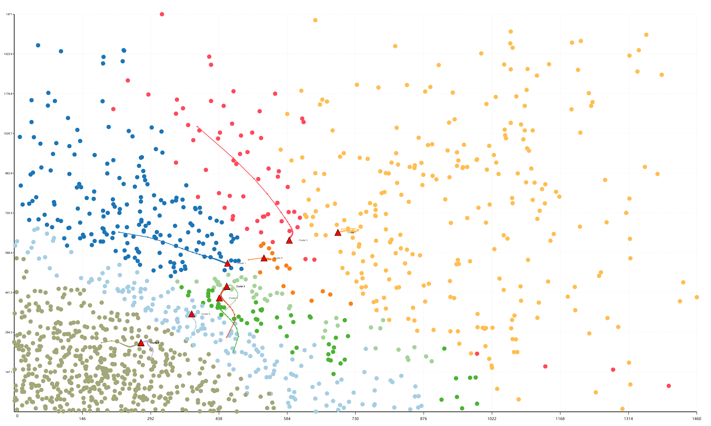

### The KMeans Binary Tree Clustering Visualization


```vbnet
Microsoft.VisualBasic.DataMining.KMeans.Tree

Public Shared Function TreeCluster(
                         _source_ As IEnumerable(Of KMeans.Entity),
              Optional _parallel_ As Boolean = False, 
              Optional _stop_ As Integer = -1) As KMeans.Entity()
```

###### Summary:
二叉树聚类的路径会在Microsoft.VisualBasic.DataMining.KMeans.Entity.uid上面出现

###### Parameters:
_source_: 

_parallel_: 

_stop_: Max iteration number for the kmeans kernel

###### Returns:

### Fuzzy C-Means



```vbnet
Imports Microsoft.VisualBasic.DataMining.FuzzyCMeans

Public Shared Function FuzzyCMeans(
                                         data As IEnumerable(Of FuzzyCMeans.Entity), 
                             numberOfClusters As Integer, 
              Optional fuzzificationParameter As Double = 2, 
              Optional maxIterates As Integer = 32767, 
              Optional threshold As Double = 0.001, 
              Optional ByRef trace As Dictionary(Of Integer, List(Of FuzzyCMeans.Entity)) = Nothing) As List(Of FuzzyCMeans.Entity)
              
    ' Member of Microsoft.VisualBasic.DataMining.FuzzyCMeans.FuzzyCMeansAlgorithm
```

###### Summary:
**Fuzzy clustering** (also referred to as **soft clustering**) is a form of clustering in which each data point can belong to more than one cluster.

###### Parameters:
_data_: 

_numberOfClusters%_: 

_fuzzificationParameter#_: This parameter value should greater than **1.0**

_maxIterates%_: 

_threshold#_: 

_trace_: 

Returns:

### GeneticAlgorithm

