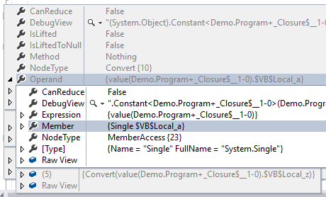

# Optional Parameter Expression in VisualBasic

You can install this VisualBasic runtime from nuget package:

```bash
# https://www.nuget.org/packages/sciBASIC#
# For install latest stable release version:
PM> Install-Package sciBASIC
```

## Background


## R language example

The R language is a kind of a popular math computation language. And like the .NET language function, the R language function is also have the optional parameter, and its optional parameter is not only a constant, and also it allows user using the R expression as its optional parameter default value. For example:

```R
# heatmap.2 {gplots}
heatmap.2 (x,
    ...
    Colv=if(symm)"Rowv" else TRUE,
    reorderfun = function(d, w) reorder(d, w),
    notecex=1.0,
    notecol="cyan",
    na.color=par("bg"),
    tracecol="cyan",
    cexRow = 0.2 + 1/log10(nr),
    cexCol = 0.2 + 1/log10(nc),
    ...
    symkey = any(x < 0, na.rm=TRUE) || symbreaks,
    ...
)
```

Example as the ``heatmap.2`` function have the optional parameter like ``cexRow`` or ``cexCol``, both of them have the R expression as the optional parameter default value.

## How to implements in VisualBasic?


### The math expression engine

First of all, for implements this new optional parameter expression language feature, an expression evaluation engine is required for the parameter expression string evaluation. Here is my previous job about development a math expression evaluation engine:

> [A complex Mathematics expression evaluation module in Visual Basic](https://www.codeproject.com/Articles/646391/A-complex-Mathematics-expression-evaluation-module)

And here is the rewrite version of this engine:

> [sciBASIC# math scripting](https://github.com/xieguigang/sciBASIC/tree/52285009eebf91ee2f2cd34be999feaf76fa993d/Data_science/Mathematical/Math/Scripting)

Here is the example coe about how to use this math expression engine:

```vbnet
Imports Microsoft.VisualBasic.Mathematical.Scripting

Dim math As New Expression
' Using this math expression evaluation engine just super easy! 
Dim result# = math.Evaluation("(cos(x/33)+1)^2-3")

Call "x <- 123 + 3^3!                 ".Evaluate
Call "     log((x+699)*9/3!)          ".Evaluate
Call "x <- log((x+699)*9/3!) + sin(99)".Evaluate
Call "x!                              ".Evaluate
Call "(1+2)! / 5                      ".Evaluate
```

### Using Linq Expressions

For evaluate the parameter expression, we should gets the parameter that required for the evaluation.

```vbnet
' Evaluate parameter manually
Dim math As New Expression

Call Math.SetVariable(NameOf(a), a)
Call Math.SetVariable(NameOf(b), b)
```

Evaluate the prameter expression is easy and works fine, but still not so handy, as we must write additional code lines and manual setup the expression and variables. From the search of CodeProject, and then I found Mr DiponRoy's post [&lt;Log All Parameters that were Passed to Some Method in C#>](https://www.codeproject.com/tips/795865/log-all-parameters-that-were-passed-to-some-method) is what i want, we can do such things automatic by using the ``Linq Expression``:




## Reference links

+ Parameter logger tools: https://www.codeproject.com/tips/795865/log-all-parameters-that-were-passed-to-some-method
+ Roslyn language feature discussion: https://github.com/dotnet/roslyn/issues/16767
+ sciBASIC# demo: https://github.com/xieguigang/sciBASIC/tree/master/docs/guides/parameter_expression

## Demo

```vbnet
Imports Microsoft.VisualBasic.Language
Imports Microsoft.VisualBasic.Mathematical.Scripting
Imports Microsoft.VisualBasic.Serialization.JSON

Module Program

    Sub Main()
        Test(1, 2, 3, z:="a+b")
        Test(2, 3, 1, y:="(a+b)*c", z:="x+y")
        Pause()
    End Sub

    Function Test(a!, b&, c#,
                  Optional x$ = "(A + b^2)! * 100",
                  Optional y$ = "(cos(x/33)+1)^2 -3",
                  Optional z$ = "log(-Y) + 9") As (before As Object(), after As Object())

        Dim before As New Value(Of Object()), after As New Value(Of Object())

        Call $"Parameter before the expression evaluation is: { (before = {a, b, c, x, y, z}).GetJson }".__DEBUG_ECHO
        Call ParameterExpression.Apply(Function() {a, b, c, x, y, z})
        Call $"Parameters after the expression evaluation is: { (after = {a, b, c, x, y, z}).GetJson }".__DEBUG_ECHO

        Return (+before, +after)
    End Function
End Module
```
