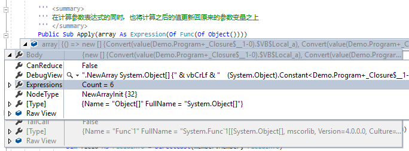

# Optional Parameter Expression

You can install this VisualBasic runtime from nuget package:

```bash
# https://www.nuget.org/packages/sciBASIC#
# For install latest stable release version:
PM> Install-Package sciBASIC
```

## R language example

The R language is a kind of a popular math calculation language, and 

```R
# heatmap.2 {gplots}
heatmap.2 (x,
    ...
    Colv=if(symm)"Rowv" else TRUE,
    reorderfun = function(d, w) reorder(d, w),
    notecex=1.0,
    notecol="cyan",
    na.color=par("bg"),
    tracecol="cyan",
    cexRow = 0.2 + 1/log10(nr),
    cexCol = 0.2 + 1/log10(nc),
    ...
    symkey = any(x < 0, na.rm=TRUE) || symbreaks,
    ...
)
```

## How to implements in VisualBasic?

### The math expression engine

First of all, for implements this new optional parameter expression language feature, an expression evaluation engine is required for the parameter expression string evaluation. Here is my previous job about development a math expression evaluation engine:

> [A complex Mathematics expression evaluation module in Visual Basic](https://www.codeproject.com/Articles/646391/A-complex-Mathematics-expression-evaluation-module)

And here is the rewrite version of this engine:

> [sciBASIC# math scripting](https://github.com/xieguigang/sciBASIC/tree/52285009eebf91ee2f2cd34be999feaf76fa993d/Data_science/Mathematical/Math/Scripting)

Here is the example coe about how to use this math expression engine:

```vbnet
Imports Microsoft.VisualBasic.Mathematical.Scripting

Dim math As New Expression
Dim result# = math.Evaluation("(cos(x/33)+1)^2-3")

Call "x <- 123 + 3^3!                 ".Evaluate
Call "     log((x+699)*9/3!)          ".Evaluate
Call "x <- log((x+699)*9/3!) + sin(99)".Evaluate
Call "x!                              ".Evaluate
Call "(1+2)! / 5                      ".Evaluate
```

### Using Linq Expressions




## Reference links

+ Parameter logger tools: https://www.codeproject.com/tips/795865/log-all-parameters-that-were-passed-to-some-method
+ Roslyn language feature discussion: https://github.com/dotnet/roslyn/issues/16767
+ sciBASIC# demo: https://github.com/xieguigang/sciBASIC/tree/master/docs/guides/parameter_expression

## Demo

```vbnet
Imports Microsoft.VisualBasic.Language
Imports Microsoft.VisualBasic.Mathematical.Scripting
Imports Microsoft.VisualBasic.Serialization.JSON

Module Program

    Sub Main()
        Test(1, 2, 3, z:="a+b")
        Test(2, 3, 1, y:="(a+b)*c", z:="x+y")
        Pause()
    End Sub

    Function Test(a!, b&, c#,
                  Optional x$ = "(A + b^2)! * 100",
                  Optional y$ = "(cos(x/33)+1)^2 -3",
                  Optional z$ = "log(-Y) + 9") As (before As Object(), after As Object())

        Dim before As New Value(Of Object()), after As New Value(Of Object())

        Call $"Parameter before the expression evaluation is: { (before = {a, b, c, x, y, z}).GetJson }".__DEBUG_ECHO
        Call ParameterExpression.Apply(Function() {a, b, c, x, y, z})
        Call $"Parameters after the expression evaluation is: { (after = {a, b, c, x, y, z}).GetJson }".__DEBUG_ECHO

        Return (+before, +after)
    End Function
End Module
```