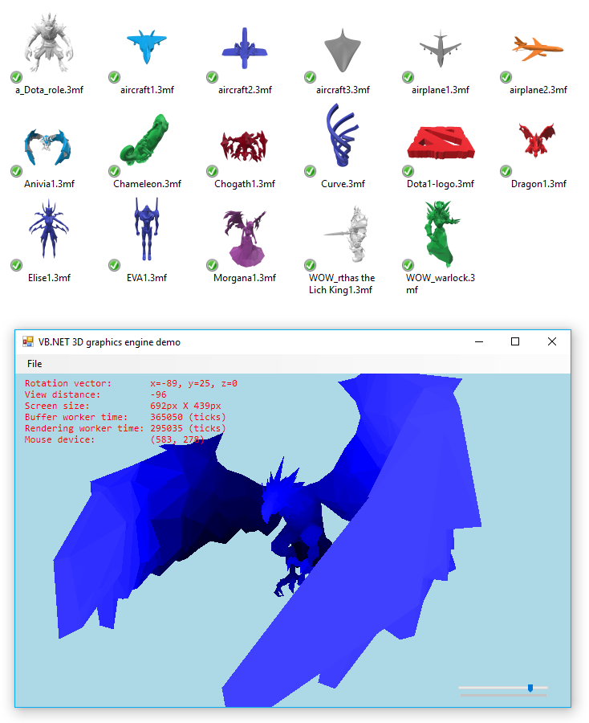

## Build My Own 3D graphics engine step by step



Although this gdi+ based 3D graphic engine have the problem when the , but it is enough for the 3D plots for the scientific computing.

### The 3D rotation


3D Rotation is more complicated than 2D rotation since we must specify an axis of rotation. In 2D the axis of rotation is always perpendicular to the **x,y** plane, i.e., the Z axis, but in 3D the axis of rotation can have any spatial orientation. We will first look at rotation around the three principle axes **(X, Y, Z)** and then about an arbitrary axis. Note that for Inverse Rotation: **replace q with -q and then R(R-1) = 1**

#### Z-Axis Rotation

Z-axis rotation is identical to the 2D case:

```vbnet
' x' = x*cos q - y*sin q
' y' = x*sin q + y*cos q
' z' = z
'
'          | cos q  sin q  0  0|
' Rz (q) = |-sin q  cos q  0  0|
'          |     0      0  1  0|
'          |     0      0  0  1|

Public Function RotateZ(angle As Single) As Point3D
    Dim rad As Single, cosa As Single, sina As Single, Xn As Single, Yn As Single

    rad = angle * Math.PI / 180
    cosa = Math.Cos(rad)
    sina = Math.Sin(rad)
    Xn = Me.X * cosa - Me.Y * sina
    Yn = Me.X * sina + Me.Y * cosa
    Return New Point3D(Xn, Yn, Me.Z)
End Function
```

#### X-Axis Rotation

X-axis rotation looks like Z-axis rotation if replace:

> X axis with Y axis
> Y axis with Z axis
> Z axis with X axis

So we do the same replacement in the equations:
```vbnet
' y' = y*cos(q) - z*sin(q)
' z' = y*sin(q) + z*cos(q)
' x' = x
'
'         |1      0       0   0|
' Rx(q) = |0  cos(q)  sin(q)  0|
'         |0 -sin(q)  cos(q)  0|
'         |0      0       0   1|

Public Function RotateX(angle As Single) As Point3D
    Dim rad As Single, cosa As Single, sina As Single, yn As Single, zn As Single

    rad = angle * Math.PI / 180
    cosa = Math.Cos(rad)
    sina = Math.Sin(rad)
    yn = Me.Y * cosa - Me.Z * sina
    zn = Me.Y * sina + Me.Z * cosa
    Return New Point3D(Me.X, yn, zn)
End Function
```

#### Y-Axis Rotation

Y-axis rotation looks like Z-axis rotation if replace:

> X axis with Z axis
> Y axis with X axis
> Z axis with Y axis

So we do the same replacement in equations :

```vbnet
' z' = z*cos(q) - x*sin(q)
' x' = z*sin(q) + x*cos(q)
' y' = y
'
'         |cos(q)  0  -sin(q)  0|
' Ry(q) = |    0   1       0   0|
'         |sin(q)  0   cos(q)  0|
'         |    0   0       0   1|

Public Function RotateY(angle As Single) As Point3D
    Dim rad As Single, cosa As Single, sina As Single, Xn As Single, Zn As Single

    rad = angle * Math.PI / 180
    cosa = Math.Cos(rad)
    sina = Math.Sin(rad)
    Zn = Me.Z * cosa - Me.X * sina
    Xn = Me.Z * sina + Me.X * cosa

    Return New Point3D(Xn, Me.Y, Zn)
End Function
```


### The projection
### The painter algorithm

### 3mf format

### The display device
#### Buffer thread
#### Graphics rendering