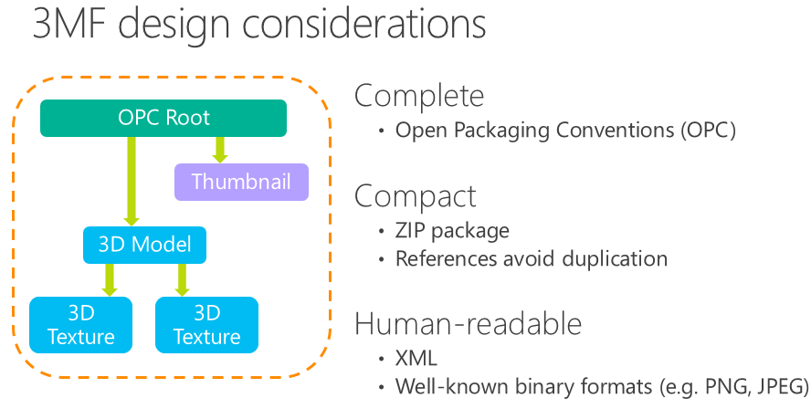
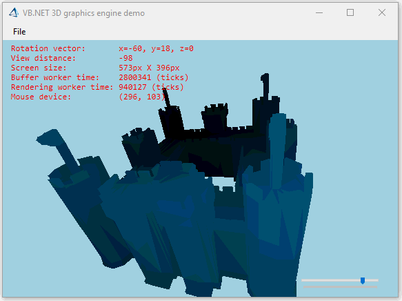

## Build My Own 3D graphics engine step by step


Although this gdi+ based 3D graphic engine have the problem when the , but it is enough for the 3D plots for the scientific computing.

### The 3D rotation


3D Rotation is more complicated than 2D rotation since we must specify an axis of rotation. In 2D the axis of rotation is always perpendicular to the **x,y** plane, i.e., the Z axis, but in 3D the axis of rotation can have any spatial orientation. We will first look at rotation around the three principle axes **(X, Y, Z)** and then about an arbitrary axis. Note that for Inverse Rotation: **replace q with -q and then R(R-1) = 1**

#### Z-Axis Rotation

Z-axis rotation is identical to the 2D case:

```vbnet
' x' = x*cos q - y*sin q
' y' = x*sin q + y*cos q
' z' = z
'
'          | cos q  sin q  0  0|
' Rz (q) = |-sin q  cos q  0  0|
'          |     0      0  1  0|
'          |     0      0  0  1|

Public Function RotateZ(angle As Single) As Point3D
    Dim rad As Single, cosa As Single, sina As Single, Xn As Single, Yn As Single

    rad = angle * Math.PI / 180
    cosa = Math.Cos(rad)
    sina = Math.Sin(rad)
    Xn = Me.X * cosa - Me.Y * sina
    Yn = Me.X * sina + Me.Y * cosa
    Return New Point3D(Xn, Yn, Me.Z)
End Function
```

#### X-Axis Rotation

X-axis rotation looks like Z-axis rotation if replace:

+ X axis with Y axis
+ Y axis with Z axis
+ Z axis with X axis

So we do the same replacement in the equations:
```vbnet
' y' = y*cos(q) - z*sin(q)
' z' = y*sin(q) + z*cos(q)
' x' = x
'
'         |1      0       0   0|
' Rx(q) = |0  cos(q)  sin(q)  0|
'         |0 -sin(q)  cos(q)  0|
'         |0      0       0   1|

Public Function RotateX(angle As Single) As Point3D
    Dim rad As Single, cosa As Single, sina As Single, yn As Single, zn As Single

    rad = angle * Math.PI / 180
    cosa = Math.Cos(rad)
    sina = Math.Sin(rad)
    yn = Me.Y * cosa - Me.Z * sina
    zn = Me.Y * sina + Me.Z * cosa
    Return New Point3D(Me.X, yn, zn)
End Function
```

#### Y-Axis Rotation

Y-axis rotation looks like Z-axis rotation if replace:

+ X axis with Z axis
+ Y axis with X axis
+ Z axis with Y axis

So we do the same replacement in equations :

```vbnet
' z' = z*cos(q) - x*sin(q)
' x' = z*sin(q) + x*cos(q)
' y' = y
'
'         |cos(q)  0  -sin(q)  0|
' Ry(q) = |    0   1       0   0|
'         |sin(q)  0   cos(q)  0|
'         |    0   0       0   1|

Public Function RotateY(angle As Single) As Point3D
    Dim rad As Single, cosa As Single, sina As Single, Xn As Single, Zn As Single

    rad = angle * Math.PI / 180
    cosa = Math.Cos(rad)
    sina = Math.Sin(rad)
    Zn = Me.Z * cosa - Me.X * sina
    Xn = Me.Z * sina + Me.X * cosa

    Return New Point3D(Xn, Me.Y, Zn)
End Function
```

### The 3D projection

> https://en.wikipedia.org/wiki/3D_projection

To project the 3D point a<sub>x</sub>, a<sub>y</sub>, a<sub>z</sub> onto the 2D point b<sub>x</sub>, b<sub>y</sub> using an orthographic projection parallel to the y axis (profile view), the following equations can be used:

+ b<sub>x</sub> = s<sub>x</sub> \* a<sub>x</sub> + c<sub>x</sub>
+ b<sub>y</sub> = s<sub>z</sub> \* a<sub>z</sub> + c<sub>z</sub>

where the vector ``s`` is an arbitrary scale factor, and ``c`` is an arbitrary offset. These constants are optional, and can be used to properly align the viewport.

```vbnet
''' <summary>
''' Project the 3D point to the 2D screen.
''' </summary>
''' <param name="x!"></param>
''' <param name="y!"></param>
''' <param name="z!">Using for the painter algorithm.</param>
''' <param name="viewWidth%"></param>
''' <param name="viewHeight%"></param>
''' <param name="fov%"></param>
''' <param name="viewDistance%">
''' View distance to the model from the view window.
''' </param>
Public Sub Project(ByRef x!, ByRef y!, z!,
                   viewWidth%,
                   viewHeight%,
                   viewDistance%,
                   Optional fov% = 256)

    Dim factor! = fov / (viewDistance + z)

    ' 2D point result (x, y)
    x = x * factor + viewWidth / 2
    y = y * factor + viewHeight / 2
End Sub
```

### The painter algorithm

The painter's algorithm, also known as a priority fill, is one of the simplest solutions to the visibility problem in 3D computer graphics. When projecting a 3D scene onto a 2D plane, it is necessary at some point to decide which polygons are visible, and which are hidden.

The name "painter's algorithm" refers to the technique employed by many painters of painting distant parts of a scene before parts which are nearer thereby covering some areas of distant parts. The painter's algorithm sorts all the polygons in a scene by their depth and then paints them in this order, farthest to closest. It will paint over the parts that are normally not visible — thus solving the visibility problem — at the cost of having painted invisible areas of distant objects. The ordering used by the algorithm is called a 'depth order', and does not have to respect the numerical distances to the parts of the scene: the essential property of this ordering is, rather, that if one object obscures part of another then the first object is painted after the object that it obscures. Thus, a valid ordering can be described as a topological ordering of a directed acyclic graph representing occlusions between objects.


One simple method to implements this painter algorithm is using the ``z-order`` method

> https://en.wikipedia.org/wiki/Z-order

```vbnet
''' <summary>
''' ``PAINTERS ALGORITHM`` kernel
''' </summary>
''' <typeparam name="T"></typeparam>
''' <param name="source"></param>
''' <param name="z">计算出z轴的平均数据</param>
''' <returns></returns>
<Extension>
Public Function OrderProvider(Of T)(source As IEnumerable(Of T), z As Func(Of T, Double)) As List(Of Integer)
    Dim order As New List(Of Integer)
    Dim avgZ As New List(Of Double)

    ' Compute the average Z value of each face.
    For Each i As SeqValue(Of T) In source.SeqIterator
        Call avgZ.Add(z(+i))
        Call order.Add(i)
    Next

    Dim iMax%, tmp#

    ' Next we sort the faces in descending order based on the Z value.
    ' The objective is to draw distant faces first. This is called
    ' the PAINTERS ALGORITHM. So, the visible faces will hide the invisible ones.
    ' The sorting algorithm used is the SELECTION SORT.
    For i% = 0 To avgZ.Count - 1
        iMax = i

        For j = i + 1 To avgZ.Count - 1
            If avgZ(j) > avgZ(iMax) Then
                iMax = j
            End If
        Next

        If iMax <> i Then
            tmp = avgZ(i)
            avgZ(i) = avgZ(iMax)
            avgZ(iMax) = tmp

            tmp = order(i)
            order(i) = order(iMax)
            order(iMax) = tmp
        End If
    Next

    Call order.Reverse()

    Return order
End Function
```

### 3mf format


3MF is a new 3D printing format that will allow design applications to send full-fidelity 3D models to a mix of other applications, platforms, services and printers. The 3MF specification allows companies to focus on innovation, rather than on basic interoperability issues, and it is engineered to avoid the problems associated with other 3D file formats.

> http://www.3mf.io/what-is-3mf/

Due to the reason of 3MF is an XML-based data format designed for using additive manufacturing, so that we can easily load the model in the ``*.3mf`` file using xml de-serialization in VisualBasic, and the xml model for this serialization operation is avaliable in namespace: ``Microsoft.VisualBasic.Imaging.Drawing3D.Landscape.Vendor_3mf.XML``

Open the 3mf model file just using one simple function:

```vbnet
Imports Microsoft.VisualBasic.Imaging.Drawing3D.Landscape

Dim project As Vendor_3mf.Project = Vendor_3mf.IO.Open(file)
Dim surfaces As Surface() = project.GetSurfaces(True)
```



```vbnet
Public Class Project

    ''' <summary>
    ''' ``*.3mf/Metadata/thumbnail.png``
    ''' </summary>
    ''' <returns></returns>
    Public Property Thumbnail As Image
    ''' <summary>
    ''' ``*.3mf/3D/3dmodel.model``
    ''' </summary>
    ''' <returns></returns>
    Public Property model As XmlModel3D

    Public Shared Function FromZipDirectory(dir$) As Project
        Return New Project With {
            .Thumbnail = $"{dir}/Metadata/thumbnail.png".LoadImage,
            .model = IO.Load3DModel(dir & "/3D/3dmodel.model")
        }
    End Function

    ''' <summary>
    ''' Get all of the 3D surface model data in this 3mf project.
    ''' </summary>
    ''' <param name="centraOffset"></param>
    ''' <returns></returns>
    Public Function GetSurfaces(Optional centraOffset As Boolean = False) As Surface()
        If model Is Nothing Then
            Return {}
        Else
            Dim out As Surface() = model.GetSurfaces.ToArray

            If centraOffset Then
                With out.Centra
                    out = .Offsets(out).ToArray
                End With
            End If

            Return out
        End If
    End Function
End Class
```

### The display device
#### Buffer thread

```vbnet
''' <summary>
''' The polygon buffer unit after the 3D to 2D projection and the z-order sorts.
''' (经过投影和排序操作之后的多边形图形缓存单元)
''' </summary>
Public Structure Polygon

    ''' <summary>
    ''' The 3D projection result buffer
    ''' </summary>
    Dim points As Point()
    ''' <summary>
    ''' Surface fill
    ''' </summary>
    Dim brush As Brush
End Structure
```

#### Graphics rendering

##### The light source



```vbnet
''' <summary>
''' Makes the 3D graphic more natural.
''' </summary>
''' <param name="surfaces">
''' Polygon buffer.(经过投影和排序之后得到的多边形的缓存对象)
''' </param>
''' <returns></returns>
<Extension>
Public Function Illumination(surfaces As IEnumerable(Of Polygon)) As IEnumerable(Of Polygon)
    Dim array As Polygon() = surfaces.ToArray
    Dim steps! = 0.75! / array.Length
    Dim dark! = 1.0!

    ' 不能够打乱经过painter算法排序的结果，所以使用for循环
    For i As Integer = 0 To array.Length - 1
        With array(i)
            If TypeOf .brush Is SolidBrush Then
                Dim color As Color = DirectCast(.brush, SolidBrush).Color
                Dim points As Point() = .points

                color = color.Dark(dark)
                array(i) = New Polygon With {
                    .brush = New SolidBrush(color),
                    .points = points
                }
            End If
        End With

        dark -= steps
    Next

    Return array
End Function
```