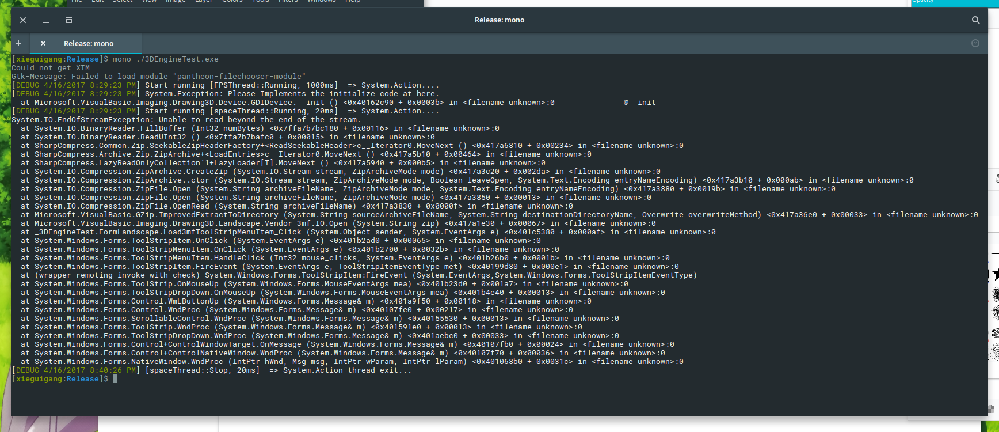

# Isometric 3D model Engine

You can install the latest sciBASIC environment from nuget:

```bash
# https://www.nuget.org/packages/sciBASIC#
PM> Install-Package sciBASIC -Pre
```


> Testing the VB.NET 3D graphics engine on the latest Ubuntu platform.

And I hope this post can help on your linux-Game Development.



> But unfortunatly, the zip library in mono runtime didn't works correctly on the linux platform, so that the 3mf 3D model can not be load by the 3D engine currently

### Introduct Isometric

The Isometric graphics model is a 3D graphics generator on the Android platform. And you can download the original isometric code for Android in java language from github:

> https://github.com/FabianTerhorst/Isometric

By click on the menu from: ``File -> Load Model -> Isometric *`` to view the demo isometric engine generated 3D model:


And this demo application running well on the Linux platform.

## Using the code & Demo

For using the code, you must reference to the dll module ``Microsoft.VisualBasic.Imaging.dll`` at first, and then imports the namespace:

```vbnet
Imports Microsoft.VisualBasic.Imaging
Imports Microsoft.VisualBasic.Imaging.Drawing3D
Imports Microsoft.VisualBasic.Imaging.Drawing3D.Models.Isometric
Imports IsometricView = Microsoft.VisualBasic.Imaging.Drawing3D.IsometricEngine
```

For creates an isometric graphic engine, using the code:

```vbnet
Dim view As New IsometricView
```

Using ``Add`` method to add your Path3D or Shape3D model:

```vbnet
' For example, create a simple cube model:
Call isometricView.Add(New Shapes.Prism(New Point3D(0, 0, 0)), Color.FromArgb(33, 150, 243))
```

At last, using ``Draw`` method for output the 3D model onto a canvas object, and here is an example for output the 3D graphics to a png image:

```vbnet
Sub measureAndScreenshotView(view As IsometricView,
                             width%,
                             height%,
                             <CallerMemberName> Optional name$ = Nothing)

    Using g As Graphics2D = New Size(width, height).CreateGDIDevice
        Call view.Draw(g)
        Call g.ImageResource.SaveAs($"./{name}.png")
    End Using
End Sub
```


This demo was build with VisualStudio 2017 and tested successfully on the latest mono + Ubuntu Linux platform.