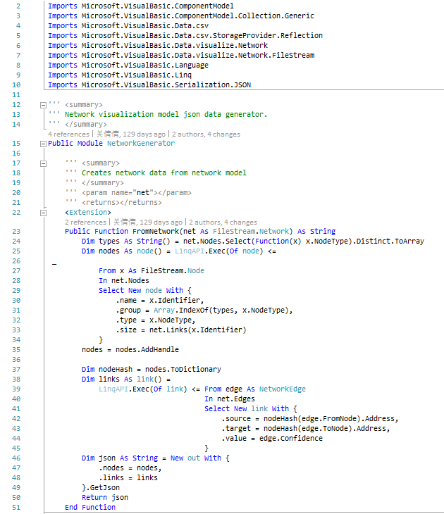

##Common Architecture of a CLI program

There is a VisualBasic application helper module that define in the namespace:
Microsoft.VisualBasic.App

Module Program

    ''' 

    ''' This is the main entry point of your VisualBasic application.
    ''' 

    ''' <returns></returns>
    Public Function Main() As Integer
        Return GetType(CLI).RunCLI(App.CommandLine)
    End Function
End Module

Where, the type **CLI** is the CLI interface which it is a module that contains all of the CLI command of your application. And the extension function RunCLI is a CLI extension method from the VisualBasic App helper: Microsoft.VisualBasic.App. The property value of App.CommandLine is the commandline argument of current application that user used for start this application and calling for some CLI command which is exposed in CLI module.

###How to define the CLI module?
A module is a static Class type in the VisualBasic, and it usually used for the API exportation and common method definition for a set of similarity or functional correlated utility functions.

And then so that the CLI module in the VisualBasic can be explained as: <b>A module for exposed the CLI interface API to your user.</b>

Here is a example:

Partial Module CLI

    <ExportAPI("/Print", Usage:="/Print /in <inDIR> [/ext <ext> /out <out.Csv>]")>
    Public Function Print(args As CommandLine.CommandLine) As Integer
        Dim ext As String = args.GetValue("/ext", "*.*")
        Dim inDIR As String = args - "/in"
        Dim out As String = args.GetValue("/out", inDIR.TrimDIR & ".contents.Csv")
        Dim files As IEnumerable(Of String) =
            ls - l - r - wildcards(ext) <= inDIR
        Dim content As NamedValue(Of String)() =
            LinqAPI.Exec(Of NamedValue(Of String)) <= From file As String
                                                      In files
                                                      Let name As String = file.BaseName
                                                      Let genome As String = file.ParentDirName
                                                      Select New NamedValue(Of String)(genome, name)
        Return content.SaveTo(out).CLICode
    End Function
End Module

###How to expose the CLI interface API in your application?

A wrapper for parsing the commandline from your user is already been defined in namespace: Microsoft.VisualBasic.CommandLine

And the CLI interface should define as in the format of this example:

Imports Microsoft.VisualBasic.CommandLine
Imports Microsoft.VisualBasic.CommandLine.Reflection

<ExportAPI("/Print", Usage:="/Print /in <inDIR> [/ext <ext> /out <out.Csv>]")>
Public Function CLI_API(args As CommandLine) As Integer

##VisualBasic variable names

Directory type
If possible, then all of the directory path variable can be UPCASE, such as:
Dim DIR As String = "/home/xieguigang/Downloads"
Dim EXPORT As String = "/usr/lib/GCModeller/"

Module variable
All of the module variable should in format like _lowerUper if the variable is private
But if the variable is Public or Friend visible, then it should in format like UperUper

Here is some example:

' Private

Dim _fileName As String
Dim _inDIR As Directory

' Public
Public ReadOnly Property FileName As String
Public ReadOnly Property InDIR As Directory

Linq Expression
All of the Linq Expression is recommended execute using LinqAPI if the output type of the expression is a known type:

